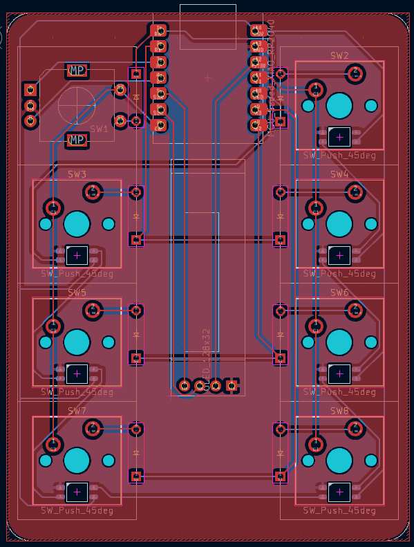
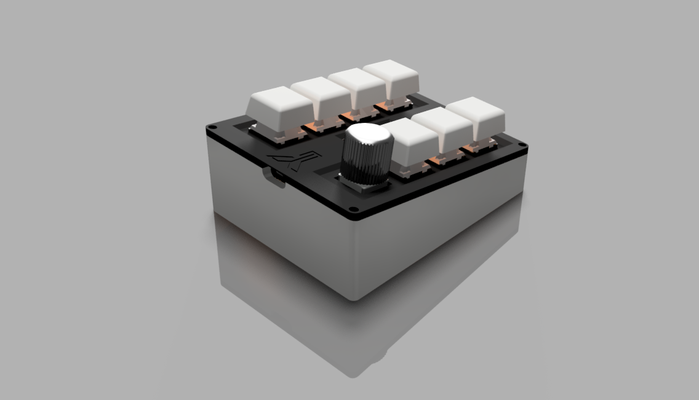

# M7R
A 7 Keys Macropad with a Rotary Encoder and a 0.91 inch OLED Display powered by SeeedStudio XIAO RP2040

## Features
- Utility Shortcuts
- Per Key RGB
- Multiple Layers
- OLED Display

## Bill of Materials

|       Name       |      Footprint      |  Quantity  |
|------------------|---------------------|------------|
|     MX Switch    |     MX_PCB_1.00u    |      7     |
|       Diode      |     Diode_DO-35     |      8     |
|  Rotary Encoder  |   Encoder_EC11_MX   |      1     |
|   OLED Display   |     OLED_128x32     |      1     |
|        LED       |    LED_SK6812MINI   |      7     |
|  XIAO RP2040 MCU |  Seeed_XIAO_RP2040  |      1     |
|        PCB       |          -          |      1     |
|   Printed Case   |          -          |      1     |

## Images

### Schematic

### PCB (Front)

### PCB (Back)

### PCB (3D Front)

### PCB (3D Back)

### Case

## Additional Information

- **Firmware**: [KMK](https://github.com/KMKfw/kmk_firmware/)
- **Symbols and FootPrints**: [ScottoKicad](https://github.com/joe-scotto/scottokeebs/tree/main/Extras/ScottoKicad)
- **PCB Software**: [Kicad](https://www.kicad.org/)
- **3D Design Software**: [Autodesk Fusion 360](https://www.autodesk.com/in/products/fusion-360/overview)
